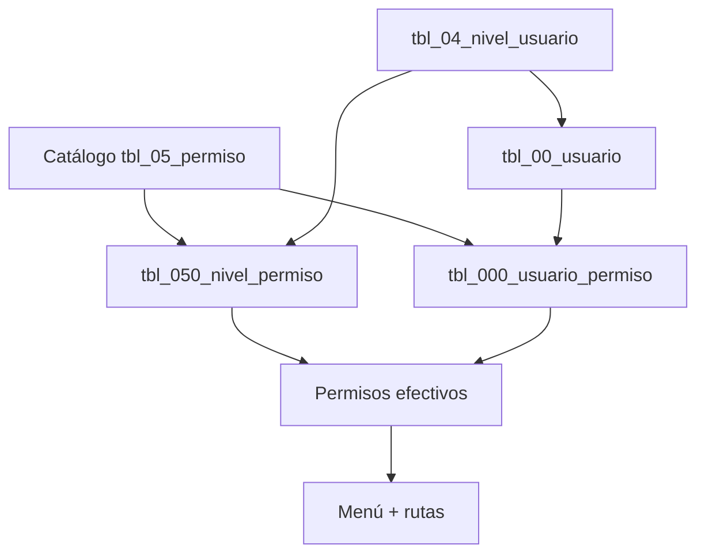

# Manual: Asignación de permisos — Mantect ERP

Guía del sistema de control de acceso, ordenada **de lo más básico a lo más granular**.  
Fuentes en código: `frontend/src/components/Sidebar.tsx`, `frontend/src/App.tsx`, `frontend/src/constants/permisoModuloRangos.ts`.

---

## 1. Idea general

Un **permiso** es una llave con nombre fijo (por ejemplo `MENU_DASHBOARD`). Si el usuario la tiene, puede ver un ítem del menú y abrir la pantalla asociada.

**Permisos efectivos del usuario:**

```text
Permisos finales = Permisos de su NIVEL  ∪  Permisos DIRECTOS del usuario
```



Tras cambiar permisos, el usuario debe **cerrar sesión y volver a entrar** (o recargar la página) para que el menú se actualice.

---

## 2. Regla padre + hijo (importante)

Para ver un **grupo** del menú (Operaciones, Neumáticos, Mantenedores, etc.) el usuario necesita:

1. **Permiso padre** — abre el grupo en el sidebar (`MENU_NEUMATICOS`, `MENU_OPERACIONES`, …).
2. **Al menos un permiso hijo** — muestra cada submenú dentro del grupo.

Si solo tiene el hijo sin el padre, **no verá el grupo**.  
Neumáticos y Operaciones son **módulos independientes**: `MENU_OPERACIONES` no da acceso a Neumáticos.

**Ejemplo — solo Historial de neumáticos:**

```text
MENU_NEUMATICOS                  ← padre (grupo visible)
MENU_NEUMATICOS_HISTORIAL        ← hijo (submenú Historial)
```

---

## 3. Rangos de orden por módulo

El campo **Orden** en el catálogo agrupa permisos por posición en el sidebar:

| Rango | Módulo |
|-------|--------|
| 1000–1999 | Inicio |
| 2000–2999 | Nivel de Acceso |
| 3000–3999 | Operaciones |
| 4000–4999 | Neumáticos |
| 5000–5999 | Gestión Alternadores |
| 6000–6999 | Mantenedores |
| 7000–7999 | Reportes |

---

## 4. Las 5 capas (de menor a mayor control)

| Capa | Qué es | Pantalla | Uso |
|------|--------|----------|-----|
| 1 | Permiso (catálogo) | Nivel de Acceso → **Permisos** | Definir llaves disponibles |
| 2 | Nivel de acceso (rol) | Nivel de Acceso → **Nivel de Acceso** | Agrupar usuarios |
| 3 | Nivel ↔ Permiso | **Asignación Niveles** | Dar permisos a un rol (**recomendado**) |
| 4 | Usuario ↔ Nivel | **Usuarios** | Heredar permisos del rol |
| 5 | Usuario ↔ Permiso directo | **Permisos Directos** | Excepciones o usuarios sin nivel |

**Regla práctica:** configura casi todo por **nivel** (capas 1–4). Usa **permisos directos** solo para excepciones puntuales.

---

## 5. Catálogo de permisos del menú actual

Extraído de `Sidebar.tsx` y `App.tsx`.

### Inicio (1000)

| Permiso | Pantalla |
|---------|----------|
| `MENU_DASHBOARD` | Inicio |

### Nivel de Acceso (2000)

| Permiso | Pantalla |
|---------|----------|
| `MENU_NIVEL_ACCESO` | Grupo Nivel de Acceso |
| `MENU_NIVEL_ACCESO_USUARIOS` | Usuarios |
| `MENU_NIVEL_ACCESO_PERMISOS` | Catálogo de permisos |
| `MENU_NIVEL_ACCESO_NIVELES` | Nivel de acceso (roles) |
| `MENU_NIVEL_ACCESO_ASIGNACION` | Asignación niveles |
| `MENU_NIVEL_ACCESO_PERMISOS_DIRECTOS` | Permisos directos |
| `MENU_NIVEL_ACCESO_HISTORIAL` | Historial contraseñas |
| `MENU_NIVEL_ACCESO_INTENTOS` | Intentos de login |
| `MENU_NIVEL_ACCESO_SESIONES` | Sesiones |
| `MENU_NIVEL_ACCESO_PARAMETROS` | Parámetros del sistema |

### Operaciones (3000) — independiente de Neumáticos

| Permiso | Pantalla |
|---------|----------|
| `MENU_OPERACIONES` | Grupo Operaciones + Consumo insumos |
| `MENU_OPERACIONES_ORDENES_TRABAJO` | Órdenes de trabajo |
| `MENU_OPERACIONES_ASIGNACION_ASEO` | Asignación productos aseo |
| `MENU_OPERACIONES_ASIGNACION_PRENDAS` | Asignación de prendas |

### Neumáticos (4000) — módulo propio

| Permiso | Pantalla |
|---------|----------|
| `MENU_NEUMATICOS` | Grupo Neumáticos |
| `MENU_NEUMATICOS_COD_TRAZABILIDAD` | Cod trazabilidad |
| `MENU_NEUMATICOS_MARCAS` | Marcas |
| `MENU_NEUMATICOS_ESTADOS` | Estados |
| `MENU_NEUMATICOS_HISTORIAL` | Historial |
| `MENU_NEUMATICOS_PATRONES_ROTACION` | Patrones de rotación |
| `MENU_NEUMATICOS_TIPO_LLANTA` | Tipo llanta |

### Gestión Alternadores (5000)

| Permiso | Pantalla |
|---------|----------|
| `MENU_GESTION_ALTERNADORES` | Grupo Gestión Alternadores |
| `MENU_GESTION_ALTERNADORES_ALTERNADORES` | Alternadores |
| `MENU_GESTION_ALTERNADORES_ESTADO` | Estado alternador |
| `MENU_GESTION_ALTERNADORES_BODEGAS` | Bodegas |
| `MENU_GESTION_ALTERNADORES_TIPOS_TRANSACCION` | Tipos de transacción |
| `MENU_GESTION_ALTERNADORES_MOVIMIENTOS` | Movimientos |
| `MENU_GESTION_ALTERNADORES_STOCK` | Stock actual |
| `MENU_GESTION_ALTERNADORES_MARCAS` | Marca alternadores |

### Mantenedores (6000)

| Permiso | Pantalla |
|---------|----------|
| `MENU_MANTENEDORES` | Grupo Mantenedores |
| `MENU_MANTENEDORES_CARGOS` | Cargos |
| `MENU_MANTENEDORES_TECNICOS` | Técnicos |
| `MENU_MANTENEDORES_TRABAJADORES` | Trabajadores |
| `MENU_MANTENEDORES_PRODUCTOS_ASEO` | Productos de aseo |
| `MENU_MANTENEDORES_MAQUINAS` | Máquinas |
| `MENU_MANTENEDORES_RESPONSABLES_ENTREGA` | Responsables de entrega |
| `MENU_MANTENEDORES_TIPOS_COMP` | Tipos componente |
| `MENU_MANTENEDORES_CATEGORIAS` | Categorías |
| `MENU_MANTENEDORES_TALLAS` | Tallas |
| `MENU_MANTENEDORES_PRENDAS` | Prendas |
| `MENU_MANTENEDORES_CCOSTOS` | Centros de costo |
| `MENU_MANTENEDORES_INSUMOS` | Insumos |

### Reportes (7000)

| Permiso | Pantalla |
|---------|----------|
| `MENU_REPORTES` | Reportes |

> **Permisos legacy obsoletos** (no usar en asignaciones nuevas): `MENU_INVENTARIO*`, `MENU_MANTENEDORES_ALTERNADORES`, `MENU_MANTENEDORES_MARCAS`, `MENU_MANTENEDORES_ESTADOS`, nombres antiguos de neumáticos (`MENU_MANTENEDORES_MARCAS_NEUMATICOS`, etc.).

---

## 6. Administrador del sistema (permisos mínimos)

Para gestionar usuarios y permisos:

```text
MENU_DASHBOARD
MENU_NIVEL_ACCESO
MENU_NIVEL_ACCESO_USUARIOS
MENU_NIVEL_ACCESO_NIVELES
MENU_NIVEL_ACCESO_PERMISOS
MENU_NIVEL_ACCESO_ASIGNACION
MENU_NIVEL_ACCESO_PERMISOS_DIRECTOS
MENU_NIVEL_ACCESO_HISTORIAL      (opcional)
MENU_NIVEL_ACCESO_INTENTOS       (opcional)
MENU_NIVEL_ACCESO_SESIONES       (opcional)
MENU_NIVEL_ACCESO_PARAMETROS     (opcional)
```

---

## 7. Cómo se aplican en tiempo de ejecución

1. Login → token en `localStorage`
2. Hook `useUserPermissions` → `GET /api/auth/permissions`
3. `Sidebar` filtra ítems con `hasPermission`
4. `App.tsx` → `hasRouteAccess` bloquea rutas sin permiso

---

## 8. Ejemplos

### Operador con Operaciones + Neumáticos completos

```text
MENU_DASHBOARD
MENU_OPERACIONES
MENU_OPERACIONES_ORDENES_TRABAJO
MENU_OPERACIONES_ASIGNACION_ASEO
MENU_OPERACIONES_ASIGNACION_PRENDAS
MENU_NEUMATICOS
MENU_NEUMATICOS_COD_TRAZABILIDAD
MENU_NEUMATICOS_MARCAS
MENU_NEUMATICOS_ESTADOS
MENU_NEUMATICOS_HISTORIAL
MENU_NEUMATICOS_PATRONES_ROTACION
MENU_NEUMATICOS_TIPO_LLANTA
```

### Operador solo Historial de neumáticos (permisos directos)

Nivel mínimo + excepción por usuario:

```text
# En el ROL (Asignación Niveles):
MENU_DASHBOARD

# Directos al usuario (Permisos Directos):
MENU_NEUMATICOS
MENU_NEUMATICOS_HISTORIAL
```

### Operador solo Asignación de Prendas

```text
MENU_DASHBOARD
MENU_OPERACIONES
MENU_OPERACIONES_ASIGNACION_PRENDAS
```

---

## 9. Problemas frecuentes

| Problema | Solución |
|----------|----------|
| No ve menús | Asignar nivel o permisos directos; incluir `MENU_DASHBOARD` |
| Ve grupo pero no subpantalla | Agregar permiso **hijo** específico |
| Tiene hijo pero no ve el grupo | Agregar permiso **padre** (`MENU_NEUMATICOS`, etc.) |
| Neumáticos no aparece con solo `MENU_OPERACIONES` | Normal: asignar permisos `MENU_NEUMATICOS*` |
| Cambios no se ven | Cerrar sesión y volver a entrar |
| No aparece “Nivel de Acceso” | Otro admin debe dar `MENU_NIVEL_ACCESO` |

---

## 10. Documentos relacionados

- [Plantilla Operador / Supervisor / Administrador](./plantilla-niveles-permisos.md)
- [Reporte del catálogo](./reporte-permisos.md)
- Código: `frontend/src/hooks/useUserPermissions.ts`
- API permisos efectivos: `GET /api/auth/permissions`
- Auditoría de rol: `node backend/scripts/audit-nivel-permisos.mjs "OPERADOR"`

---

## 11. Referencias de aprendizaje

- [React — Forms](https://react.dev/reference/react-dom/components/form)
- [Fetch API — MDN](https://developer.mozilla.org/es/docs/Web/API/Fetch_API/Using_Fetch)
